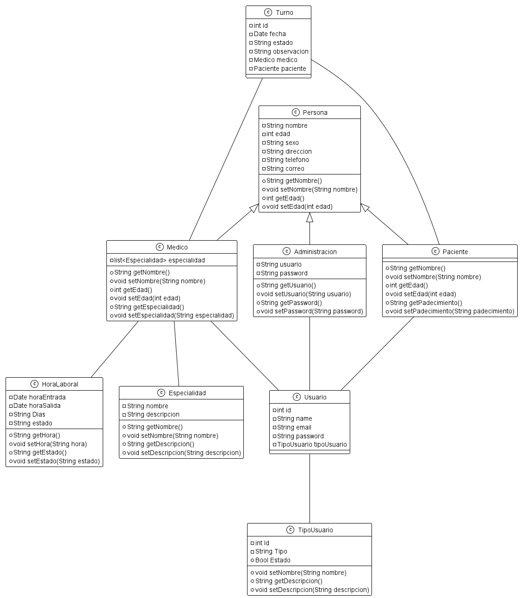

# tp-cuatrimestral-equipo-23
## Trabajo final para la materia Programación III - UTN FRGP
```
Propuesta Clínica
```
Se requiere una aplicación para administrar la asignación de turnos, pacientes y médicos de una clínica médica.
En el sistema se cargarán los médicos, que estarán asociados a una o más especialidades y a un turno de trabajo, y los pacientes con toda su información personal. 
Los turnos de trabajo serán administrados por el usuario y podrán cargar el horario de entrada y salida que demanden; pudiendo haber tantos turnos de trabajo como se necesite.
La funcionalidad central de la aplicación es gestionar los tiempos de los especialistas a partir de la asignación de turnos a los pacientes.
Para dar de alta un turno el usuario deberá seleccionar un paciente (que deberá estar previamente cargado), y seleccionar una especialidad. 
A partir de la especialidad seleccionada el sistema debería proponerle algunas opciones en cuanto a horarios y médicos. Por ejemplo, si se elige “Dentista” el sistema debería sugerir tres horarios posibles con su respectivo médico. El usuario podrá elegirlo u optar por seguir cargando el formulario de manera manual. 
El siguiente dato a cargar es el médico, una vez allí se podrá seleccionar un día y se deberán mostrar los horarios disponibles del médico seleccionado en el día seleccionado.
No puede existir más de un turno para el mismo médico, el mismo día a la misma hora. Lo mismo
para el paciente. 
No se pueden dar de alta turnos vencidos. 
Por último, se deben cargar las observaciones que corresponden a la causa por la cual el paciente solicita el turno. 
Una vez dado de alta el turno, se le asigna un número y se envía por mail la confirmación del mismo con los datos correspondientes al paciente (debe tener cargado correctamente el correo electrónico en el sistema).
Los turnos pueden ser re programados o cancelados pero nunca deberían ser eliminados.
Se puede manejar un modelo de estado para los turnos con fines informativos y estadístcos a futuro. Por ejemplo: Nuevo, Reprogramado, Cancelado, No Asistió, Cerrado, etc.
Los tiempos de los turnos se proponen se configuren de una hora de duración (de 10 a 11, de 11 a 12, etc.).

La aplicación debe manejar seguridad y perfiles de acceso. 
Administrador: Puede ver y manipular todo 
Recepcionista: Puede administrar pacientes y médicos y dar de alta turnos. 
Médicos: Sólo podrán ver sus turnos asociados y modificarlos para agregar las observaciones sobre el diagnóstico del paciente.

```
ETAPAS DE ENTREGA
```
 * ETAPA 1
Para la primera etapa del TPC se solicita:
•	La arquitectura de clases (modelo de dominio),
•	Armado de pantallas de la aplicación (SIN funcionalidad, sólo ventanas, algunos controles y navegación) y
•	Lectura desde base de datos de al menos UNA entidad.

 * ETAPA 2
Para la segunda etapa del TPC se solicita:
•	Completar y corregir las cuestiones pendientes de la primera etapa.
•	Desarrollar los ABMs y listados de las entidades administradas de la aplicación, pero NO de las que correspondan a la funcionalidad core (Turnos, Incidencia, Venta, etc)
Nota: Tener en cuenta validaciones, diseño visual, seguir ampliando/corrigiendo el modelo.

* ETAPA 3
Para la tercera etapa del TPC deberán construir:
•	La funcionalidad del core de la aplicación (turnos: nuevo, reprogramar, mesa: abrir, generar pedido, cerrar; ventas: comprar, vender, etc.)
•	Las funcionalidades que aportan valor agreado al core (búsquedas dinámicas, registrarse, olvidé mi pass, etc.)
•	Validaciones a lo largo de la aplicación: tipos de datos, requeridos, formatos.

```
ETAPA FINAL
```
Para la cuarta y última entrega del TPC deberán:
•	Cerrar toda la funcionalidad pendiente (abms y filtrados en todas las entidades).
•	Validaciones a lo largo de toda la aplicación (web y escritorio).
•	Seguridad y perfiles de usuario, con la funcionalidad correspondiente para cada perfil (web y escritorio).
•	Optimización del diseño visual de cara al usuario (colorcitos, botoncitos lindos, etc). Principalmente en web, pero aplica a escritorio también.
```
UML
```
<p align="center">
  <a href="" target="blank"></a>
</p>